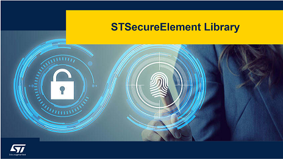
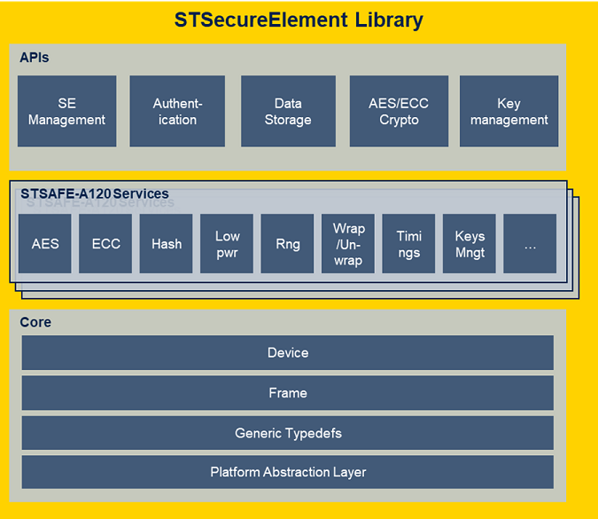

# STMicroelectronics Secure Element Library (STSELib)



The STSELib middleware provides a complete set of high-level Application Programming Interface functions to the embedded system developer. This Middleware abstract the build and the sequencing of the commands required to ensure device , accessories and consumable brand protection using STMicroelectronics STSAFE-A secure element family.

This middleware allows a seamless integration of one or multiple STSAFE-A in various host MCU/MPU ecosystem.

The STSELib middleware is composed of three software modules as illustrated in the figure below. Each layer provides a different level of system abstraction to the embedded system developer.



<b>- Application Programming Interface (API) layer</b>
This software layer is the entry point for the system application. It provides a set of high level functions allowing interaction with STMicroelectronics Secure Elements.

<b>- Service layer</b>
Provides a set of product services that format all commands supported by the targeted secure element and reports response to higher layers API/Application . This layer can be used directly from Application (for advanced user).

<b>- Core layer</b>
Contains generic definition for ST Secure Element and functions for communicating with target secure element.

## Package documentation

HTML documentation can either be downloaded as standalone package from the STSELib github repository [release section](https://github.com/STMicroelectronics/STSELib/releases)
or compiled from the library sources by executing following commands from the STSELib root directory:

```bash
    cd Middleware/STSELib/doc/resources/
    doxygen STSELib.doxyfile
```

> [!NOTE]
>
> Doxygen version 1.14.0 is required to build the documentation

## STSELib Integration

### 1. Add STSELib as a Git submodule

From your project root:

```bash
git submodule add https://github.com/STMicroelectronics/STSELib.git lib/stselib
git submodule update --init --recursive
```

> [!NOTE]
>
> Don’t forget to add lib/stselib to your CMakeLists.txt include paths.

### 2. Base configuration

Two headers files are mantatories, [`stse_conf.h`](doc/resources/Markdown/03_LIBRARY_CONFIGURATION/03_LIBRARY_CONFIGURATION.md) and [`stse_platform_generic.h`](doc/resources/Markdown/04_PORTING_GUIDE/PAL_files/stse_platform_generic.h.md).

### 3. Optional files

For platform-specific integrations and STSafe use-cases, you may implement additional headers. Detailed specifications are available in the HTML documentation included in the release ZIP.
Reference implementation for most common STSE applicative use case can be found in section "Reference applicative examples" of this ReadMe file

## Reference applicative examples

Following applicative project can be used as reference for STSELib integration and usage.

- STSAFE-A
    - [STSAFE-A_Examples](https://github.com/STMicroelectronics/STSAFE-A120_examples)

- STSAFE-L
    - [STSAFE-L_echo](https://github.com/STMicroelectronics/STSAFE-L_echo)
    - [STSAFE-L_device_authentication](https://github.com/STMicroelectronics/STSAFE-L_device_authentication)
    - [STSAFE-L_secure_data_storage](https://github.com/STMicroelectronics/STSAFE-L_secure_data_storage)
