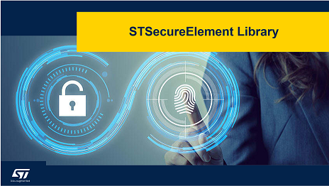
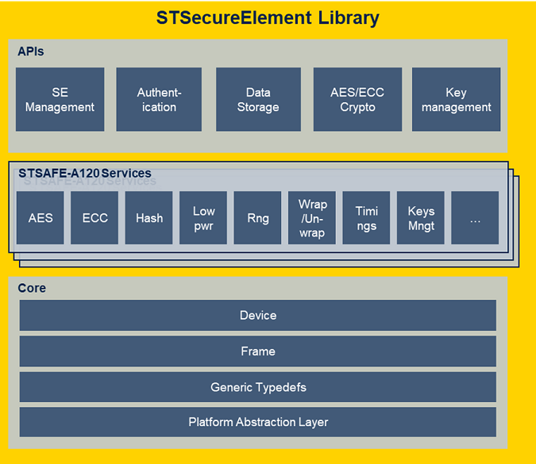

# STMicroelectronics Secure Element Library (STSELib)



**STSELib** is a modular, portable middleware providing a high-level C API for embedded developers. It abstracts command/response frame serialization, cryptographic token management, secure transaction sequencing, and physical bus operations required for authentication, brand protection, and secure data storage using STMicroelectronics secure elements (**STSAFE-A** and **STSAFE-L** series).

The library enables turnkey integration of one or multiple secure elements across diverse host MCU and MPU ecosystems.

## Architecture Overview

STSELib is designed around three decoupled software layers, offering varying levels of abstraction depending on system requirements:



* **Application Programming Interface (API) Layer**  
  The primary entry point for embedded applications. It provides ready-to-use, high-level functions covering standard secure element operations (e.g., asymmetric authentication, key establishment, secure counter management).

* **Service Layer**  
  Formats product-specific command frames, manages payload serialization and deserialization, and decodes response frames returned by the target device. Advanced applications can interface directly with this layer for specialized workflows.

* **Core Layer**  
  Provides hardware-agnostic communication primitives, device handler abstractions, and the Platform Abstraction Layer (PAL) interface required to bind physical transport buses (I²C, 1-Wire) to the host hardware.

## Documentation

Comprehensive HTML documentation generated via Doxygen is available through two channels:

* **Precompiled packages**: Download the standalone documentation archive from the [STSELib Releases](https://github.com/STMicroelectronics/STSELib/releases) page.
* **Local build**: Generate it directly from the library repository:

```bash
cd Middleware/STSELib/doc/resources/
doxygen STSELib.doxyfile
```

> [!NOTE]
> Building documentation locally requires **Doxygen 1.14.0** or higher.

## STSELib Integration

### 1. Add STSELib as a Git Submodule

Add the library to your host project tree:

```bash
git submodule add https://github.com/STMicroelectronics/STSELib.git lib/stselib
git submodule update --init --recursive
```

> [!TIP]
> Ensure `lib/stselib` (along with its public header subdirectories) is added to your build system's include directories (e.g., `target_include_directories` in `CMakeLists.txt`).

### 2. Mandatory Configuration Files

To port STSELib, two configuration files must be available in your application include path:

* [`stse_conf.h`](doc/resources/Markdown/03_LIBRARY_CONFIGURATION/03_LIBRARY_CONFIGURATION.md): Defines device family targets, enabled features, cryptographic algorithms, and buffer allocations.
* [`stse_platform_generic.h`](doc/resources/Markdown/04_PORTING_GUIDE/PAL_files/stse_platform_generic.h.md): Maps the low-level Platform Abstraction Layer (PAL) hooks (bus read/write, GPIO toggle, millisecond delay, mutex primitives) to your target MCU/MPU hardware drivers.

### 3. Optional Configuration & Platform Bindings

Depending on your security architecture and target use case, additional headers can be implemented to plug in hardware-accelerated cryptographic primitives or RTOS synchronization wrappers. Detailed specifications and template implementations are provided in the [Porting Guide](doc/resources/Markdown/04_PORTING_GUIDE/).

Integration examples and reference platform bindings can be found across the repositories listed in [Related Packages & Ecosystem Integrations](#related-packages--ecosystem-integrations) below.

## Related Packages & Ecosystem Integrations

| Package / Repository | Target Secure Element | Compatible Framework / OS | Target Host MCU / MPU | Maintainer / Provider |
| :--- | :--- | :--- | :--- | :--- |
| [**X-CUBE-STSE01**](https://www.st.com/en/embedded-software/x-cube-stse01.html) | STSAFE-A & STSAFE-L series | STM32Cube (HAL / LL) | STM32 MCUs | [STMicroelectronics](https://www.st.com/) |
| [**stsafe-a-sdk**](https://github.com/STMicroelectronics/STSAFE-A120-sdk) | STSAFE-A series | Bare-metal, Portable ANSI C | Generic MCUs / STM32 | [STMicroelectronics](https://www.st.com/) |
| [**stsafe-l-sdk**](https://github.com/STMicroelectronics/stsafe-l-sdk) | STSAFE-L series | Bare-metal, Portable ANSI C | Generic MCUs / STM32 | [STMicroelectronics](https://www.st.com/) |
| [**stse-linux**](https://github.com/STMicroelectronics/stse-linux) | STSAFE-A series | Linux (User-space / PKCS#11) | Linux MPUs (STM32MP1, etc.) | [STMicroelectronics](https://www.st.com/) |
| [**wolfssl-examples**](https://github.com/wolfSSL/wolfssl-examples/tree/master/stsafe) | STSAFE-A series | wolfSSL / wolfCrypt | Embedded MCUs | [wolfSSL](https://www.wolfssl.com/) |
| [**Zephyr_st-stsafe-a1xx**](https://github.com/catie-aq/zephyr_st-stsafe-a1xx) | STSAFE-A series | Zephyr RTOS | Zephyr-supported MCUs | [CATIE](https://www.catie.fr/language/en/home/) |

## License

This software package is licensed by STMicroelectronics under standard evaluation and BSD-3-Clause terms. Refer to the [`LICENSE`](LICENSE) file in the root directory for full licensing details.
