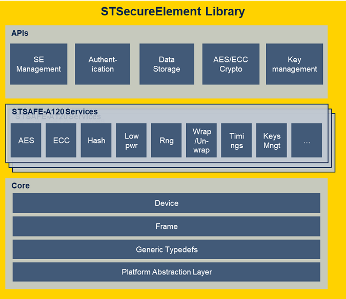

# Introduction

  

The STSELib middleware provides a complete set of high-level Application Programming Interface functions to the embedded system developer. This Middleware abstract the build and the sequencing of the commands required to ensure peripheral/accessories and consumable brand protection using STMicroelectronics STSAFE-Axxx device family. 
Thanks to its modular architecture , this middleware allows a seamless integration of one or multiple STSAFE-Axxx device in various host MCU/MPU ecosystem. The STSELib middleware is composed of three software modules as illustrated in the figure below.

Each layer provides a different level of system abstraction to the embedded system developer.

- Application Programming Interface (API) layer
This software layer is the entry point for the system application. It provides a set of high level functions allowing interaction with STMicroelectronics Secure Elements.

- Service layer
Provides a set of product services   that format all commands supported by the targeted secure element 
and reports response to higher layers API/Application . This layer can be used directly from Application 
(advanced user) 

- Core layer
Contains generic definition for ST Secure Element and functions for communicating with target secure element

More details on each layers can be found in the "Modules Documentation" section of the documentation

\subpage stse_certificate

\subpage stse_api

\subpage stse_services

\subpage stse_core

